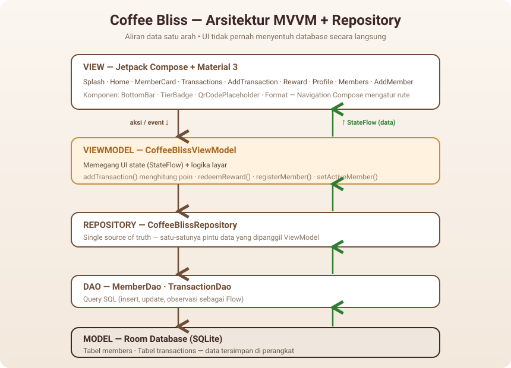

# ☕ Coffee Bliss — [Membership Card App](https://drive.google.com/drive/u/0/folders/1UaFZSnxcLH1PzHpEyF0UR_kwqso5Z3IH)

> Aplikasi Android kartu member digital untuk coffee shop: simpan kartu di ponsel,
> kumpulkan poin otomatis dari setiap pembelian, lihat riwayat transaksi, naik level
> membership, dan tukarkan poin dengan reward.

---

## 1. Tentang Aplikasi

**Coffee Bliss** adalah aplikasi loyalitas (membership) berbasis Android yang
menggantikan kartu member fisik dengan **kartu member digital**. Seorang member bisa
melihat kartunya, mencatat pembelian untuk mendapatkan poin, melihat riwayat transaksi,
naik tingkat keanggotaan (Silver → Gold → Platinum), dan menukar poin dengan hadiah —
semuanya dari satu aplikasi, tanpa perlu membawa kartu.

Aplikasi berjalan **sepenuhnya offline**: seluruh data disimpan di perangkat menggunakan
Room Database, sehingga member dan poin tetap ada setelah aplikasi ditutup. Teks antarmuka
menggunakan Bahasa Indonesia agar sesuai dengan pengguna sasaran.

### Kebermanfaatan

Bagi **pelanggan**, kartu tidak lagi mudah hilang, poin selalu bisa diakses, dan
riwayat transaksi serta progres menuju reward terlihat jelas. Bagi **kasir/barista**,
pencatatan transaksi menjadi cepat dan poin dihitung otomatis tanpa perlu hitung manual.
Bagi **pemilik coffee shop**, program loyalitas berjalan tanpa biaya cetak kartu dan
lebih mudah dikelola. Sebagai proyek, aplikasi ini juga ditulis agar **mudah dibaca dan
dijelaskan** oleh seseorang yang baru belajar Android.

---

## 2. Product Requirement

### Problem Statement

Coffee shop saat ini masih menggunakan kartu member fisik untuk program loyalitas. Kartu
fisik **mudah hilang**, **sulit diperbarui**, **membutuhkan biaya cetak**, dan **tidak
dapat menampilkan riwayat transaksi**. Akibatnya pelanggan sering kehilangan kartu
sehingga poin tidak dapat digunakan, dan coffee shop kesulitan mencatat transaksi member
secara manual. Dibutuhkan aplikasi membership digital yang memungkinkan pelanggan memiliki
kartu digital, mengumpulkan poin, dan memperoleh reward secara otomatis.

### User Persona

| | Persona 1 | Persona 2 |
|---|-----------|-----------|
| **Nama** | Andi | Rina |
| **Umur** | 22 tahun | 30 tahun |
| **Pekerjaan** | Mahasiswa | Barista |
| **Kebutuhan** | Mengumpulkan poin, melihat reward, tidak ingin membawa kartu fisik | Menambahkan transaksi pelanggan, melihat status member |

### Fitur (Functional Requirements)

| ID | Fitur | Deskripsi singkat | Lokasi di kode |
|----|-------|-------------------|----------------|
| FR-01 | **Registrasi Member** | Membuat member baru (nama, email, no. HP) | `AddMemberScreen.kt` + `registerMember()` |
| FR-02 | **Daftar Member** | Menampilkan & berpindah antar member | `MembersScreen.kt` + `getAllMembers()` |
| FR-03 | **Membership Card** | Kartu digital: nama, ID, level, total poin, QR | `MemberCardScreen.kt` |
| FR-04 | **Tambah Transaksi** | Catat pembelian → poin bertambah otomatis | `AddTransactionScreen.kt` + `addTransaction()` |
| FR-05 | **Riwayat Transaksi** | Daftar transaksi (tanggal, nominal, poin) | `TransactionsScreen.kt` |
| FR-06 | **Redeem Reward** | Tukar poin dengan hadiah | `RewardScreen.kt` + `redeemReward()` |

**Dua aturan inti:**

- **Poin** — 1 poin untuk setiap Rp 10.000 yang dibelanjakan. Contoh: Rp 150.000 → 15 poin.
- **Reward** — Espresso (50), Cappuccino (100), Latte Gratis (150). Saat redeem, poin
  berkurang; jika poin kurang, tombol Redeem dinonaktifkan.

**Membership Tier (tambahan):** member naik level berdasarkan total poin yang pernah
diperoleh — **Silver** (0), **Gold** (100), **Platinum** (300). Tier dihitung dari
poin seumur hidup, jadi status tidak hilang saat poin ditukar (`MemberTier.kt`).

### Non-Functional Requirements

Aplikasi mengutamakan **reliability** (data tetap tersedia setelah ditutup, tersimpan
lokal di Room), **performance** (startup < 3 detik, query database < 500 ms), **usability**
(UI sederhana, Material Design 3), dan **maintainability** (pola MVVM + Repository).

### Scope

**In scope:** registrasi member, dashboard, membership card, sistem poin, riwayat
transaksi, redeem reward, Room Database.
**Out of scope:** online payment, cloud database, login Google, push notification,
multi-device sync.

---

## 3. Arsitektur

Aplikasi menggunakan arsitektur **MVVM (Model–View–ViewModel) + Repository Pattern**.
Data mengalir **satu arah**: UI tidak pernah menyentuh database secara langsung, melainkan
selalu melalui ViewModel dan Repository. State mengalir balik ke UI sebagai `StateFlow`.



**Penjelasan tiap lapisan:**

- **View (Jetpack Compose + Material 3)** — kumpulan layar (Splash, Home, Member Card,
  Transactions, Add Transaction, Reward, Profile, Members, Add Member). `Navigation Compose`
  mengatur perpindahan antar layar.
- **ViewModel (`CoffeeBlissViewModel`)** — menyimpan state layar sebagai `StateFlow` dan
  berisi logika seperti menghitung poin (`addTransaction`) dan menukar reward (`redeemReward`).
- **Repository (`CoffeeBlissRepository`)** — *single source of truth*, satu-satunya pintu
  data yang dipanggil ViewModel.
- **DAO (`MemberDao`, `TransactionDao`)** — kumpulan query SQL ke database.
- **Model (Room Database / SQLite)** — tabel `members` dan `transactions`, tersimpan di
  perangkat. Database menanam 3 member demo saat pertama kali dijalankan.

### Tech Stack

| Area | Pilihan |
|------|---------|
| Bahasa | **Kotlin** |
| UI | **Jetpack Compose** + **Material 3** |
| Arsitektur | **MVVM** + **Repository** |
| Database lokal | **Room** |
| State | **StateFlow** |
| Navigasi | **Navigation Compose** |
| Build | Gradle (Kotlin DSL) + version catalog (`gradle/libs.versions.toml`) |

### Struktur folder

```
app/src/main/java/com/example/coffeebliss/
├── CoffeeBlissApplication.kt     Membuat database + repository (sekali, dibagikan).
├── MainActivity.kt               Satu-satunya Activity. Menampilkan aplikasi Compose.
│
├── data/                         ===== MODEL: lapisan data =====
│   ├── Member.kt                 Tabel "members" (+ tier dari total poin).
│   ├── Transaction.kt            Tabel "transactions".
│   ├── MemberDao.kt              Query database untuk member.
│   ├── TransactionDao.kt         Query database untuk transaksi.
│   ├── CoffeeBlissDatabase.kt    Room database + seed 3 member demo.
│   ├── CoffeeBlissRepository.kt  Single source of truth.
│   ├── MemberTier.kt             Logika tier Silver/Gold/Platinum.
│   └── Reward.kt                 Menu reward tetap (50/100/150 poin).
│
├── ui/viewmodel/
│   └── CoffeeBlissViewModel.kt   State layar + aksi.
├── ui/navigation/
│   └── CoffeeBlissNavigation.kt  Daftar rute & koneksi antar layar.
├── ui/screens/                   ===== VIEW: satu file per layar =====
├── ui/components/                Potongan UI reusable (BottomBar, TierBadge, QR, Format).
└── ui/theme/                     Warna, tipografi, branding kopi (Material 3).
```

### Cara menjalankan repo ini

1. Buka **Android Studio** → *Open* → pilih folder `CoffeeBliss`.
2. Tunggu Gradle sync (mengunduh library saat pertama kali — perlu internet).
3. Pilih emulator atau perangkat (Android 7.0 / API 24 atau lebih baru).
4. Tekan **Run ▶**. Aplikasi terbuka dengan **3 member demo** yang sudah tersimpan.
5. Atau download .apk-nya di sini

**Urutan baca kode yang disarankan bila masih baru:** `Member.kt` → `MemberDao.kt` →
`CoffeeBlissRepository.kt` → `CoffeeBlissViewModel.kt` → `HomeScreen.kt` →
`CoffeeBlissNavigation.kt`.

## 3. Link Download Aplikasi .APK
[https://drive.google.com/file/d/1RTqSf-BgijF_7UEqIsNBBZUxPDLZKFww/view?usp=sharing](https://drive.google.com/file/d/1RTqSf-BgijF_7UEqIsNBBZUxPDLZKFww/view?usp=sharing)
## 4. Link YouTube Demo

## 5. Link Blogspot
